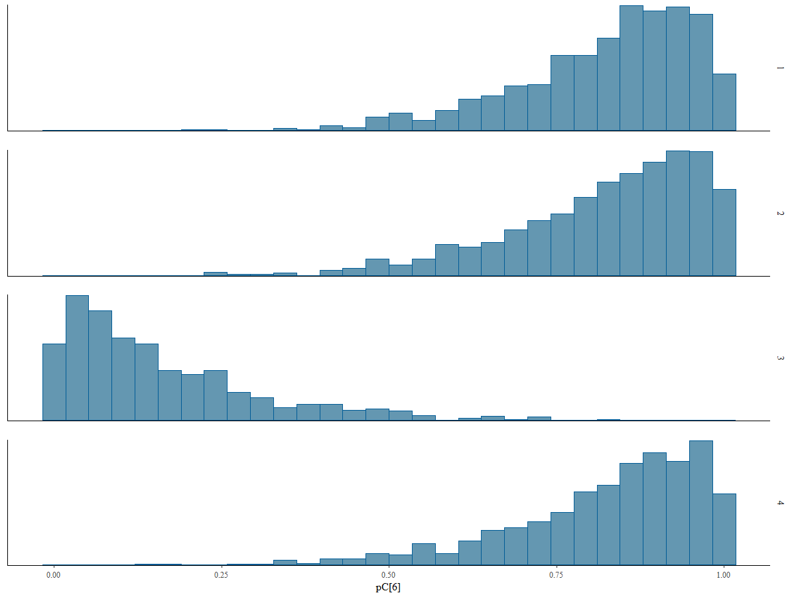

```{r klippy, echo=FALSE, include=TRUE}
klippy::klippy(position=c('top','right'),color='#33C1FF')
```


<style>
.list-group-item.active, .list-group-item.active:focus, .list-group-item.active:hover {
    z-index: 2;
    color: #fff;
    background-color: #33C1FF;
    border-color: #97CAEF;
}

</style>


```{r setup, include=FALSE}
knitr::opts_chunk$set(comment = "",fig.align='center',message = FALSE,warning = FALSE)
require(here)
require(ggplot2)
require(plot3D)
require(kableExtra)
require(knitr)
require(giski)
require(magick)

options(scipen=99)

```

`r paste('[Updated:',format(Sys.time(),'%a, %b %d, %Y - %H:%M:%S'),']')`

<font color="black">


```{r, eval=TRUE,echo=FALSE}
require(cmdstanr)
fit <- readRDS(here("./no_upload/model_fit.RDS"))


rt.long <- read.csv(here('./data/simdata_long.csv'))
rt      <- read.csv(here('./data/simdata_wide.csv'))
```

# Acknowledgement

This tutorial is a product of a research project funded by Duolingo, Inc. through Competitive Research Grant Program to support topics of interest related to Duolingo's English Test's ongoing research agenda.

# Introduction

This tutorial provides a detailed introduction to an enhanced version of the model initially introduced by [Kasli et al. (2023)](https://doi.org/10.1111/jedm.12340). The original model assumed that the compromised status of items was known beforehand. It focused on estimating whether an examinee had item preknowledge, given a predefined vector indicating the compromise status of items using response time model. However, the study also revealed that when this vector was inaccurately specified, the model's ability to make accurate predictions declined significantly.

In the enhanced version presented here, the requirement for prior knowledge of item compromise status is removed. Instead, both examinee status and item compromise status are treated as unknown parameters to be estimated simultaneously. This upgraded model outputs two probabilities in a single analysis: the probability that an examinee has item preknowledge and the probability that an item is compromised.

# Model Description

The response time model incorporates additional parameters specific to response times while building on the notations introduced for response accuracy analysis. For the $j^{th}$ examinee
$\mathbf{RT}_j = (\mathrm{RT}_{j1}, \ldots, \mathrm{RT}_{jI})$ represents the vector of log-transformed response times for $I$ items, with realizations $\mathbf{rt}_j = (\mathrm{rt}_{j1}, \ldots, \mathrm{rt}_{jI})$. 

For the $i^{th}$ item, $\alpha_i \in \mathbb{R}^+$ and $\beta_i \in \mathbb{R}$ denote the time-discrimination and time-intensity parameters, respectively.

Two latent speed parameters are defined for each examinee: true latent speed ($\tau_{tj} \in \mathbb{R}$) used when responding to uncompromised items without prior knowledge, and cheating latent speed ($\tau_{cj} \in \mathbb{R}$) used when responding to compromised items with prior knowledge.

The log response time for the $j^{th}$ examinee on the $i^{th}$ item is modeled as:

$$
\mathrm{RT}_{ij} \sim f(\mathrm{rt}_{ij}; \tau_{tj}, \tau_{cj}, H_j, \alpha_i, \beta_i, C_i),$$

where, $f(.)$ is a normal density function and defined as:

$$
f(\mathrm{rt}_{ij}; \tau_{tj}, \tau_{cj}, H_j, \alpha_i, \beta_i, C_i) = \frac{1}{\sigma_i \sqrt{2\pi}} \exp\left(-\frac{1}{2} \left( \frac{\mathrm{rt}_{ij} - \mu_{ij}}{\sigma_i} \right)^2 \right)
$$

The mean $\mu_{ij}$ and standard deviation $\sigma_{i}$ are given by:

$$
\mu_{ij} = 
\begin{cases} 
\beta_i - \tau_{cj}, & \text{if } H_j = 1 \text{ and } C_i = 1, \\ 
\beta_i - \tau_{tj}, & \text{otherwise}.
\end{cases}
$$
$$
\sigma_i = \frac{1}{\alpha_i}
.$$

This model reflects that an examinee with prior knowledge (i.e., $H_j=1$ and $C_i=1$) uses the cheating latent speed, $\tau_{cj}$. In all other cases, the true latent speed, $\tau_{tj}$, is used.

During the model fitting process, the density, $f(\mathrm{rt}_{ij}; \tau_{tj}, \tau_{cj}, H_j, \alpha_i, \beta_i, C_i)$, is marginalized over the discrete parameters $H_j$ and $C_i$ as follows:

$$
f(\mathrm{rt}_{ij}; \tau_{tj}, \tau_{cj}, \alpha_i, \beta_i) = \sum_{H_j, C_i} f(\mathrm{rt}_{ij}; \tau_{tj}, \tau_{cj}, \alpha_i, \beta_i, H_j, C_i) \cdot P(H_j) \cdot P(C_i)
$$
To ensure model identification, the model constrained the mean of the true latent speed,$\tau_{tj}$, to be zero for scale identification.

The joint distribution of the true and cheating latent speed parameters is assumed to follow a multivariate normal distribution:

$$
\begin{pmatrix} 
\tau_{tj} \\ 
\tau_{cj}
\end{pmatrix}
\sim \mathcal{N}(\boldsymbol{\mu}_\tau, \Sigma_\tau),
$$

where,

$$
\Sigma_\tau = 
\begin{pmatrix} 
\sigma_{\tau_t}^2 & \rho_{\tau_t, \tau_c} \sigma_{\tau_t} \sigma_{\tau_c} \\ 
\rho_{\tau_t, \tau_c} \sigma_{\tau_t} \sigma_{\tau_c} & \sigma_{\tau_c}^2 
\end{pmatrix}.
$$
The priors for the mean, standard deviations, and correlation are specified as:

$$
\mu_{\tau_t} = 0, \quad \mu_{\tau_c} \sim \mathcal{N}(0, 2)
$$

$$
\sigma_{\tau_t}, \sigma_{\tau_c} \sim \text{Exponential}(1), \quad \rho_{\tau_t, \tau_c} \sim \text{LKJ}(1)
$$
Item parameters are similarly modeled as:

$$
\begin{pmatrix} 
\ln(\alpha_i) \\ 
\beta_i 
\end{pmatrix}
\sim \mathcal{N}(\boldsymbol{\mu}_I, \Sigma_I),
$$

where,

$$
\Sigma_I = 
\begin{pmatrix} 
\sigma_{\ln(\alpha)}^2 & \rho_{\ln(\alpha), \beta} \sigma_{\ln(\alpha)} \sigma_{\beta} \\ 
\rho_{\ln(\alpha), \beta} \sigma_{\ln(\alpha)} \sigma_{\beta} & \sigma_{\beta}^2 
\end{pmatrix}.
$$
The priors for the item parameters are specified as:

$$
\mu_{\ln(\alpha)} \sim \mathcal{N}(0, 0.5), \quad \mu_{\beta} \sim \mathcal{N}(4, 1), \quad \sigma_{\ln(\alpha)}, \sigma_\beta \sim \text{Exponential}(1), \quad \rho_{\ln(\alpha), \beta} \sim \text{LKJ}(1)
$$
The prior for the probabilities of $P(H_j = 1)$ and $P(C_i = 1)$ are specified as:

$$
P(H_j = 1) \sim \text{Beta}(1, 1)
$$

$$
P(C_i = 1) \sim \text{Beta}(1, 1)
$$

# Stan Model Syntax

The data block defines the structure and input data required for the model. It assumes that the data is provided in a long format, which is particularly advantageous for handling missing responses in sparse datasets. In this format, the data has at least a column for subject IDs (e.g., examinee identifiers), a column for item IDs, and another column for observed response times (or the logarithm of observed response times)

```{r, eval=FALSE,echo=TRUE}
data{
  int <lower=1> J;                       // number of examinees          
  int <lower=1> I;                       // number of items
  int <lower=1> n_obs;                   // number of observations (I xJ - missing responses)
  array[n_obs] int<lower=1> p_loc;       // person indicator   
  array[n_obs] int<lower=1> i_loc;       // item indicator
  array[n_obs] real Y;                   // vector of log of responses
}
```

The parameters and transformed parameters block specifies all the parameters required by the model. 

```{r, eval=FALSE,echo=TRUE}
parameters {
  real mu_beta;                 // mean for time intensity parameters
  real<lower=0> sigma_beta;     // sd for time intensity parameters
  
  real mu_alpha;                // mean for log of time discrimination parameters
  real<lower=0> sigma_alpha;    // sd for log of time discrimination parameters
  
  real<lower=0> sigma_taut;     // sd for tau_t
  real<lower=0> mu_tauc;        // mean for tau_c
  real<lower=0> sigma_tauc;     // sd for tau_c
  
  corr_matrix[2] omega_P;       // 2 x 2 correlation matrix for person parameters
  corr_matrix[2] omega_I;       // 2 x 2 correlation matrix for item parameters
  
  vector<lower=0,upper=1>[I] pC; // vector of length J for the probability of item compromise status
  
  vector<lower=0,upper=1>[J] pH; // vector of length I for the probability of examinee item peknowledge 
  
  array[J] ordered[2] person;    // an array with length I for person specific latent parameters
  // Each array has two elements
  // first element is tau_t
  // second element is tau_c
  // ordered vector assures that tau_c > tau_t for every person
  // to make sure chains are exploring the same mode and 
  // multiple chains do not go east and west leading multi-modal posteriors
  
  
  array[I] vector[2] item;    // an array with length J for item specific parameters
  // each array has two elements
  // first element is alpha
  // second element is beta
}
```


```{r, eval=FALSE,echo=TRUE}
transformed parameters{
  
  vector[2] mu_P;                        // vector for mean vector of person parameters 
  vector[2] mu_I;                        // vector for mean vector of item parameters
  
  vector[2] scale_P;                     // vector of standard deviations for person parameters
  vector[2] scale_I;                     // vector of standard deviations for item parameters
  
  cov_matrix[2] Sigma_P;                 // covariance matrix for person parameters
  cov_matrix[2] Sigma_I;                 // covariance matrix for item parameters
  
  mu_P[1] = 0;
  mu_P[2] = mu_tauc;
  
  scale_P[1] = sigma_taut;               
  scale_P[2] = sigma_tauc;
  
  Sigma_P = quad_form_diag(omega_P, scale_P); 
  
  mu_I[1] = mu_alpha;
  mu_I[2] = mu_beta;
  
  scale_I[1] = sigma_alpha;               
  scale_I[2] = sigma_beta;
  
  Sigma_I = quad_form_diag(omega_I, scale_I); 
}
```

In the **parameters block**, I use `array[J] ordered[2] person` to define the array for person-specific parameters instead of a simple `vector[2] person[J]`. The ordered type in Stan ensures that the elements of the vector are ordered, with the first element being smaller than the second. Specifically, in this case, it enforces that $\tau_c > \tau_t$ for every individual. 
This constraint has a crucial role in resolving potential issues with the posterior distributions. Without this enforced order, the model was prone to multi-modal posterior distributions. This problem arose because different Markov Chain Monte Carlo (MCMC) chains would explore inconsistent parameter directions. Some chains might converge on one mode, while others diverged to an alternative mode in the opposite direction, leading to incoherent results and difficulties in interpretation. Below provides an example of this issue without enforcing this order.




Finally, we specify the prior distributions and model in the **model block**. 

```{r, eval=FALSE,echo=TRUE}
model{
  
  sigma_taut  ~ exponential(1);
  sigma_tauc  ~ exponential(1);
  sigma_beta  ~ exponential(1);
  sigma_alpha ~ exponential(1);
  
  mu_tauc      ~ normal(0,2);
  
  mu_beta      ~ normal(4,1);
  mu_alpha     ~ normal(0,0.5);
  
  pC ~ beta(1,1);
  pH ~ beta(1,1);
  
  omega_P   ~ lkj_corr(1);
  omega_I   ~ lkj_corr(1);
  
  person  ~ multi_normal(mu_P,Sigma_P);
  
  item    ~ multi_normal(mu_I,Sigma_I);
  
  
  for (i in 1:n_obs) {
    
    // item[i_loc[i],1] represents log of parameter alpha of the (i_loc[i])th item
    // that's why we use exp(item[i_loc[i],1]) below 
      // item[i_loc[i],1] represents parameter beta of the (i_loc[i])th item
      
      //person[p_loc[i],1] represents parameter tau_t of the (p_loc[i])th person
      //person[p_loc[i],2] represents parameter tau_c of the (p_loc[i])th person
      
      
      real p_t = item[i_loc[i],2] - person[p_loc[i],1];   //expected response time for non-cheating response
      real p_c = item[i_loc[i],2] - person[p_loc[i],2];  //expected response time for cheating response
      
      // log of probability densities for each combination of two discrete parameters
      // (C,T) = {(0,0),(0,1),(1,0),(1,1)}
      
      real lprt1 = log1m(pC[i_loc[i]]) + log1m(pH[p_loc[i]]) + normal_lpdf(Y[i] | p_t, 1/exp(item[i_loc[i],1]));  // T = 0, C=0
      real lprt2 = log1m(pC[i_loc[i]]) + log(pH[p_loc[i]])   + normal_lpdf(Y[i] | p_t, 1/exp(item[i_loc[i],1]));  // T = 1, C=0
      real lprt3 = log(pC[i_loc[i]])   + log1m(pH[p_loc[i]]) + normal_lpdf(Y[i] | p_t, 1/exp(item[i_loc[i],1]));  // T = 0, C=1
      real lprt4 = log(pC[i_loc[i]])   + log(pH[p_loc[i]])   + normal_lpdf(Y[i] | p_c, 1/exp(item[i_loc[i],1]));  // T = 1, C=1 
      
      target += log_sum_exp([lprt1, lprt2, lprt3, lprt4]);
  }
  
}
```

The whole Stan syntax for the model can be saved as a stan file ([Download the Stan model syntax](https://raw.githubusercontent.com/czopluoglu/duolingo_dglnrt/refs/heads/main/script/dglnrt.stan)).

# Data Generation

To test the model's performance, I will simulate a dataset based on the following specifications:

- 500 hypothetical examinees respond to 50 items.

- 50 examinees (10% of all examinees) have item preknowledge for 25 items (half of items)

- The time intensity, $\beta$, and log of the time discrimination, $ln(\alpha)$ parameters are drawn from a multivariate distribution with the following values:

$$
\begin{pmatrix}
ln(\alpha) \\ \beta
\end{pmatrix}
\sim
N(\mu_{\mathcal{I}}, \Sigma_{\mathcal{I}})
$$
$$
\mu_{\mathcal{I}} = 
\begin{pmatrix}
0.5 \\ 3.5
\end{pmatrix}
$$
$$
\Sigma_{\mathcal{I}} = 
\begin{pmatrix}
0.09 & 0.015 \\
0.015 & 0.04
\end{pmatrix}
$$
The covariance matrix implies a correlation of 0.25 between $ln(\alpha)$ and $\beta$.

- The true and cheating latent speed parameters $\tau_t$ and $\tau_c$ are drawn from a multivariate distribution with the following values:

$$\begin{pmatrix}
\tau_t \\ \tau_c
\end{pmatrix}
\sim
N(\mu_{\mathcal{\tau}}, \Sigma_{\mathcal{\tau}})$$

$$\mu_{\mathcal{P}} = 
\begin{pmatrix}
0 \\ 0.4
\end{pmatrix}$$

$$\Sigma_{\mathcal{P}} = 
\begin{pmatrix}
0.0100 & 0.0105 \\
0.0105 & 0.0225
\end{pmatrix}$$

The covariance matrix implies a correlation of 0.7 between $\tau_t$ and $\tau_c$, and an average 33% reduction in response time when examinee responds to a compromised item (while reduction in response time may vary from item to item and person to person).

The code below generates response time data consistent with these specifications.

```{r, eval=FALSE,echo=TRUE}

require(MASS)
require(MBESS)
require(matrixStats)
require(psych)
################################################################################
set.seed(6202021)

N = 500       # number of examinees
n = 50        # number of items
pe <- 0.10    # proportion of examinees with item preknowledge
pi <- 0.50    # proportion of compromised items

# Generate the binary status of examinee item preknowledge
# 1: examinee has item preknowledge
# 0: examinee has item preknowledge

tmp <- runif(N,0,1)
H  <- ifelse(tmp<=quantile(tmp,pe),1,0)
H
table(H)

# Generate the binary status of item compromise
# 1: item is compromised
# 0: item is not compromised

tmp <- runif(n,0,1)
C  <- ifelse(tmp<=quantile(tmp,pi),1,0)
C
table(C)

# Generate item parameters

mu_beta        <- 3.5
mu_logalpha    <- 0.5
sigma_beta     <- 0.3
sigma_logalpha <- 0.2
omega_I        <- matrix(c(1,0.25,0.25,1),2,2)

mu_I     <- c(mu_beta,mu_logalpha)
Sigma_I  <- diag(c(sigma_beta,sigma_logalpha))%*%omega_I%*%diag(c(sigma_beta,sigma_logalpha))

item_par <- mvrnorm(n,mu=mu_I,Sigma=Sigma_I)  
  
beta  <- item_par[,1]    # time intensity parameters
alpha <- exp(item_par[,2])  # time discrimination parameters


# Generate perso parameters

mu_taut      <- 0
sigma_taut   <- 0.1
mu_tauc      <- 0.4
sigma_tauc   <- 0.15
omega_P      <- matrix(c(1,0.7,0.7,1),2,2)

mu_P     <- c(mu_taut ,mu_tauc)
Sigma_P  <- diag(c(sigma_taut,sigma_tauc))%*%omega_P%*%diag(c(sigma_taut,sigma_tauc))

tau <- mvrnorm(N,mu_P,Sigma_P)

tau_t <- tau[,1]    # true latent speed parameters 
tau_c <- tau[,2]    # true cheating speed parameters 


# Generate observed response times according to the model

rt <- matrix(nrow=N,ncol=n)

for(i in 1:N){
  for(j in 1:n){
    
    p_t <- beta[j] - tau_t[i]
    p_c <- beta[j] - tau_c[i]
    
    if(H[i] == 1 & C[j] == 1){
      rt[i,j] = exp(rnorm(1,p_c,1/alpha[j]))
    } else {
      rt[i,j] = exp(rnorm(1,p_t,1/alpha[j]))
    }
    
  }
}

# Convert it to data frame and add group membership and a unique ID

rt       <- as.data.frame(rt)
rt$group <- H
rt$id    <- 1:nrow(rt)

# Check the data

head(rt)

# Reshape it to long format (for plotting purposes)

rt.long <- reshape(data        = rt,
                   idvar       = 'id',
                   varying     = list(colnames(rt)[1:n]),
                   timevar     = "Item",
                   times       = 1:n,
                   v.names      = "RT",
                   direction   = "long")

# Add item status

rt.long$compromised <- NA

for(j in 1:n){
  
  rt.long[rt.long$Item==j,]$compromised = C[j]
  
}
################################################################################

write.csv(rt.long,'./data/simdata_long.csv',
          row.names = FALSE)  

write.csv(rt,'./data/simdata_wide.csv',
          row.names = FALSE)  

```

## Checking the simulated dataset

The table below shows the average response times for hypothetical examinees in the simulated dataset, grouped by whether they had prior knowledge of the items, for both compromised and uncompromised items. As expected, the average log response time is similar for both groups on uncompromised items. However, examinees with prior knowledge respond faster on compromised items.

```{r, eval=TRUE,echo=FALSE}
require(dplyr)
require(DT)

# Create and format the summary table
summary_table <- rt.long %>%
  group_by(compromised, Item) %>%
  summarise(
    Honest_Mean = round(mean(RT[group == 0], na.rm = TRUE), 2),
    Dishonest_Mean = round(mean(RT[group == 1], na.rm = TRUE), 2),
  ) %>%
  ungroup() %>%
  mutate(
    Compromised_Status = ifelse(compromised == 1, "Compromised", "Uncompromised")
  ) %>%
  select(Compromised_Status, Item, Honest_Mean, Dishonest_Mean)

# Display the interactive table
datatable(
  summary_table,
  options = list(
    pageLength = 50,
    autoWidth = TRUE,
    order = list(list(0, 'asc')) # Sort by Compromised_Status
  ),
  colnames = c(
    "Compromised Status", "Item Number", 
    "Honest Group Mean","Dishonest Group Mean"
  ),
  rownames = FALSE,
  caption = "Average Response Times by Group"
)

```


# Fitting the model

The first step is to structure the input data in a list format. This is required because Stan accepts data in a specific format for model fitting. Each element in the list corresponds to a variable used in the Stan model.

```{r, eval=FALSE,echo=TRUE}

data_rt <- list(
  I              = length(unique(rt_long$Item)),
  J              = length(unique(rt_long$id)),
  n_obs          = nrow(rt_long),
  p_loc          = rt_long$id,
  i_loc          = rt_long$Item,
  Y              = log(rt_long$RT)
)

```

Before fitting the model, the Stan syntax (.stan file) needs to be compiled into a format that can be executed. This step creates a cmdstan_model object.

```{r, eval=FALSE,echo=TRUE}
# Compile the model syntax

mod <- cmdstan_model('./script/dglnrt.stan')
```

## Single chain initialization

In addition to the order constraints ($\tau_c > \tau_t$), discussed earlier, I am also employing a single chain initialization strategy as a complementary approach to further mitigate the risk of label switching. By initializing the parameters near plausible values within the vicinity of a single mode, this method helps stabilize the sampling process and reduces the likelihood of components switching labels during inference. While the order constraint enforces a structural restriction to break the symmetry of the mixture components, single chain initialization adds an extra layer of robustness by anchoring the chains to a specific mode early in the sampling process. Together, these strategies work in tandem to address the challenges posed by label switching, ensuring more reliable and interpretable posterior inferences. For more information, see [this link](https://mc-stan.org/docs/stan-users-guide/problematic-posteriors.html#hacks-as-fixes).

The code below fits the model using a single chain and relatively fewer iterations. 

```{r, eval=FALSE,echo=TRUE}
fit_init <- mod$sample(
  data            = data_rt,
  chains          = 1,
  iter_warmup     = 150,
  iter_sampling   = 150,
  refresh         = 10,
  adapt_delta     = 0.99)
```

Once we fit the model with a single chain, we extract the model parameters and we will feed these values as starting parameters in the next stage.

## Multi-chain estimation

The next step is to fit the model using multiple chains and more iterations. The code below first creates a list object for starting parameters based on the output from a single chain estimation. Then, we feed these values as starting values to each chain. We are fitting the model with four chains, and each chain has 1000 warmup iterations followed by 1000 sampling iterations.

```{r, eval=FALSE,echo=TRUE}
# a vector of initial time intensity and time discrimination parameters
ipar <- matrix(fit_init$summary("item")$mean,ncol=2,byrow=FALSE) 
rownames(ipar) <- NULL
colnames(ipar) <- NULL

# a two column matrix of initial tau parameters
tau <- matrix(fit_init$summary("person")$mean,ncol=2,byrow=FALSE)
rownames(tau) <- NULL
colnames(tau) <- NULL

# A vector of initial P(H=1) parameters, probability of an examinee having item preknowledge
H <- as.vector(fit_init$summary("pH")$mean)

# A vector of initial P(C=1) parameters, probability of an item being compromised
C <- as.vector(fit_init$summary("pC")$mean)

# Put the initial estimates together as a list
start <- list(item   = ipar,
              person = tau,
              pH     = H,
              pC     = C)
```

```{r, eval=FALSE,echo=TRUE}
fit <- mod$sample(
  data            = data_rt,
  seed            = 1234,
  chains          = 4,
  parallel_chains = 4,
  iter_warmup     = 500,
  iter_sampling   = 1000,
  refresh         = 10,
  init            = list(start,start,start,start),
  adapt_delta     = 0.99)

# Save the model object with all parameters for future use or backup

fit$save_object(file = './no_upload/model_fit.RDS')
```

# Model Convergence

Ensuring model convergence is essential to verify the reliability of posterior estimates. This section outlines the evaluation of convergence diagnostics for different types of parameters in the model. The analysis follows the robust workflow detailed in Michael Betancourt's [Robust Statistical Worflow with RStan](https://betanalpha.github.io/assets/case_studies/rstan_workflow.html).

```{r, eval=TRUE,echo=TRUE}
# Extract model summary
model_summary <- as.data.frame(fit$summary(variables = c("item",
                                                         "person",
                                                         "pC",
                                                         "pH")))

# Add a column for parameter types extracted from row names
model_summary$type <- gsub("\\[.*$", "", model_summary$variable)

head(model_summary)
```

- The `summary()` function extracts posterior summaries from the fitted model.

- The `gsub()` function removes index annotations (e.g., [1], [2,1]) from parameter names to group parameters by type.

The `model_summary` can be used for further diagnostics.

## Effective Sample Sizes

The minimum size of **effective samples per iteration** is 0.112 for item parameters, 0.120 for person parameters, 0.200 for probability of item compromise (pC), and 0.869 for probability of having item preknowledge(pH). They are all far above the threshold 0.001, indicating no problem in terms of estimating the effective sample sizes.

```{r, eval=TRUE,echo=TRUE}
iter <- 4000    # number of chains x number of sampling iterations
  
model_summary$n_eff_ratio <- model_summary[,'ess_bulk'] / iter
  
psych::describeBy(model_summary$n_eff_ratio,
                  model_summary$type,
                  mat=TRUE)[,c('group1','min')]
```

The summary of effective sample sizes by each parameter type is below.

```{r, eval=TRUE,echo=TRUE}
  psych::describeBy(model_summary$ess_bulk,
                    model_summary$type,
                    mat=TRUE)[,c('group1','mean','min','max')]
``` 


```{r, eval=TRUE,echo=TRUE}
# Create a histogram of ESS values grouped by parameter type
  ggplot(model_summary, aes(x = ess_bulk)) +
    geom_histogram(fill = "blue", color = "black", alpha = 0.7) +
    facet_wrap(~type, scales = "free_y",nrow=2) +
    labs(
      title = "Distribution of ESS Values by Parameter Type",
      x = "R-hat",
      y = "Frequency"
    ) +
    theme_minimal()
```

## Split Rhat summary by Parameter type

All parameters exhibit excellent convergence with R-hat values equal or less than 1.01. The highest R-hat value observed is 1.01.

```{r, eval=TRUE,echo=TRUE}
# Create a histogram of Rhat values grouped by parameter type
ggplot(model_summary, aes(x = rhat)) +
    geom_histogram(binwidth = 0.002, fill = "blue", color = "black", alpha = 0.7) +
    facet_wrap(~type, scales = "free_y",nrow=2) +
    labs(
      title = "Distribution of R-hat Values by Parameter Type",
      x = "R-hat",
      y = "Frequency"
    ) +
    theme_minimal()
  
  psych::describeBy(model_summary$rhat,
                    model_summary$type,
                    mat=TRUE)[,c('group1','mean','min','max')]
  
  sum(model_summary$Rhat<1.01)/nrow(model_summary)
```

## Tree Depth

The results of the tree depth analysis indicate that none of the 4,000 post-warmup iterations saturated the maximum tree depth of 10 (0%). The majority of iterations achieved a tree depth of 7 (95.1%), with a smaller number reaching a tree depth of 6 (1.0%) and a tree depth of 8 (3.9%). This suggests that the sampler operated efficiently and did not encounter issues related to trajectory length limits during the model fit. No further adjustment to the max_treedepth parameter is necessary.

```{r, eval=TRUE,echo=TRUE}
# Sampler diagnostics
sampler_params <- posterior::as_draws_df(fit$sampler_diagnostics())

# Tree depths across iterations
table(sampler_params$treedepth__)
```

## E-BFMI

The E-BFMI diagnostic results reveal potential inefficiencies in the exploration of the parameter space across the chains. Specifically:

- Chain 1: E-BFMI = 0.1360 
- Chain 2: E-BFMI = 0.1621 
- Chain 3: E-BFMI = 0.1445 
- Chain 4: E-BFMI = 0.1376 

All chains demonstrate particularly poor E-BFMI values, indicating that the Hamiltonian Monte Carlo sampler struggled to efficiently explore the posterior distribution. These low values suggest that the sampler experienced short transitions between trajectories, potentially slowing down exploration and reducing the reliability of the sampling process.

```{r, eval=TRUE,echo=TRUE}
e_bfmi <- c()
  for (n in 1:4) {
    energies = sampler_params[sampler_params$.chain==n,]$energy__
    numer = sum(diff(energies)**2) / length(energies)
    denom = var(energies)
    e_bfmi[n] = numer / denom
    print(sprintf('Chain %s: E-BFMI = %s', n, numer / denom))
  }
```

## Divergences

The divergence diagnostic for this model fit indicates no divergent transitions out of the total iterations (0%). This result suggests that the Hamiltonian Monte Carlo sampler explored the posterior distribution effectively, encountering no problematic regions or pathological neighborhoods.

```{r, eval=TRUE,echo=TRUE}
100 * mean(sampler_params$divergent__)
```

# Parameter Estimates

## Person Parameter Estimates

The true latent speed parameter estimates, $\tau_t$ has a mean close to zero with a small standard deviation (0.06), indicating minimal variability and a symmetric distribution (skew = -0.04, kurtosis = -0.04). The cheating latent speed parameter estimates, $\tau_c$, has a higher mean (0.35) and standard deviation (0.10).

```{r, eval=TRUE,echo=TRUE}
tau <- matrix(fit$summary(variables = c("person"))$mean,
                ncol=2,byrow=FALSE)
psych::describe(tau)
```


```{r, eval=TRUE,echo=FALSE}
tab <- fit$summary(variables = c("person"))[,c(-3,-5,-10)]
datatable(
  tab[1:500,],
  options = list(
    pageLength = 10,
    autoWidth = FALSE),
  colnames = c(
    "Parameter","Posterior Mean", "Posterior SD", "5%","95%","Rhat","ESS"
  ),
  caption = "True Latent Speed Parameter Estimates"
)%>%
  formatStyle(
    columns = 1:ncol(tab),   # Select all columns to style
    `vertical-align` = "middle", # Center vertically
    `text-align` = "center"  # Center horizontally
  ) %>%
    formatRound(
    columns = c(2,3,4,5,6), # Format all numeric columns except ESS (column 6)
    digits = 2                  # Round to two decimals
  ) %>%
  formatRound(
    columns = 7,               # Format ESS column
    digits = 0                 # Round to no decimals
  )
```

```{r, eval=TRUE,echo=FALSE}
datatable(
  tab[501:1000,],
  options = list(
    pageLength = 10,
    autoWidth = FALSE),
  colnames = c(
    "Parameter","Posterior Mean", "Posterior SD", "5%","95%","Rhat","ESS"
  ),
  caption = "Cheating Latent Speed Parameter Estimates"
)%>%
  formatStyle(
    columns = 1:ncol(tab),   # Select all columns to style
    `vertical-align` = "middle", # Center vertically
    `text-align` = "center"  # Center horizontally
  ) %>%
    formatRound(
    columns = c(2,3,4,5,6), # Format all numeric columns except ESS (column 6)
    digits = 2                  # Round to two decimals
  ) %>%
  formatRound(
    columns = 7,               # Format ESS column
    digits = 0                 # Round to no decimals
  )
```

## Item Parameters

The log of time discrimination parameter estimates, $ln(\alpha_t)$, has a mean of 0.53 with a standard deviation of 0.25, and the time intensity parameter estimates has a mean (3.59) and standard deviation of 0.30.

```{r, eval=TRUE,echo=TRUE}
ipar <- matrix(fit$summary(variables = c("item"))$mean,
              ncol=2,byrow=FALSE)

psych::describe(ipar)
```


```{r, eval=TRUE,echo=FALSE}
tab <- fit$summary(variables = c("item"))[,c(-3,-5,-10)]

datatable(
  tab[1:50,],
  options = list(
    pageLength = 10,
    autoWidth = FALSE),
  colnames = c(
    "Parameter","Posterior Mean", "Posterior SD", "5%","95%","Rhat","ESS"
  ),
  caption = "Log of Time Discrimination Parameter Estimates"
)%>%
  formatStyle(
    columns = 1:ncol(tab),   # Select all columns to style
    `vertical-align` = "middle", # Center vertically
    `text-align` = "center"  # Center horizontally
  ) %>%
    formatRound(
    columns = c(2,3,4,5,6), # Format all numeric columns except ESS (column 6)
    digits = 2                  # Round to two decimals
  ) %>%
  formatRound(
    columns = 7,               # Format ESS column
    digits = 0                 # Round to no decimals
  )
```

```{r, eval=TRUE,echo=FALSE}
datatable(
  tab[51:100,],
  options = list(
    pageLength = 10,
    autoWidth = FALSE),
  colnames = c(
    "Parameter","Posterior Mean", "Posterior SD", "5%","95%","Rhat","ESS"
  ),
  caption = "Time Intensity Parameter Estimates"
)%>%
  formatStyle(
    columns = 1:ncol(tab),   # Select all columns to style
    `vertical-align` = "middle", # Center vertically
    `text-align` = "center"  # Center horizontally
  ) %>%
    formatRound(
    columns = c(2,3,4,5,6), # Format all numeric columns except ESS (column 6)
    digits = 2                  # Round to two decimals
  ) %>%
  formatRound(
    columns = 7,               # Format ESS column
    digits = 0                 # Round to no decimals
  )
```

## Interpreting P(C=1) and evaluating predictive performance in detecting compromised items

Two groups of items were clearly separated by the probability estimates of being compromised. The probabilities ranged from 0.14 to 0.58 with a mean of 0.30 and standard deviation of 0.12 for uncompromised items (group1 = 0), and ranged from 0.46 to 0.84 with a mean of 0.70 and standard deviation of 0.094 for compromised items (group1 = 1).

```{r, eval=TRUE,echo=TRUE}
# Retrive the true item compromise status
# from long format data

C_vec <- c()

for(kk in 1:50){
  C_vec[kk] = unique(rt.long[rt.long$Item==kk,]$compromised)
}

pC <- fit$summary(variables = c("pC"))$mean

psych::describeBy(pC,C_vec,mat=TRUE)[,c('group1','n','mean','sd','min','max')]

plot(density(pC[C_vec==0]),xlim=c(0,1),main="",ylim = c(0,8))
points(density(pC[C_vec==1]),lty=2,type='l')
```

As a numerical measure, the Area Under the Curve (AUC) was 0.99, indicating an almost perfect separation between compromised and uncompromised items.

```{r, eval=TRUE,echo=TRUE}
require(pROC)

auc(C_vec,pC)

roc_analysis <- roc(response = C_vec,
                    predictor = pC)

plot(1-roc_analysis$specificities,
     roc_analysis$sensitivities,
     xlim = c(0,1),ylim=c(0,1),
     xlab = 'False Positive Rate (1-Specificity)',
     ylab = 'True Positive Rate (Sensitivity)',
     type='l')

my_thresholds <- seq(from=0.5,to=0.8,by=0.01)

coords(roc_analysis, 
       my_thresholds, 
       input="threshold", 
       ret=c("threshold","specificity", "sensitivity"))

```

```{r, eval=TRUE,echo=FALSE}
tab <- fit$summary(variables = c("pC"))[,c(-3,-5,-10)]

datatable(
  tab,
  options = list(
    pageLength = 10,
    autoWidth = FALSE),
  colnames = c(
    "Parameter","Posterior Mean", "Posterior SD", "5%","95%","Rhat","ESS"
  ),
  caption = "Probability Estimates of Items Being Compromised"
)%>%
  formatStyle(
    columns = 1:ncol(tab),   # Select all columns to style
    `vertical-align` = "middle", # Center vertically
    `text-align` = "center"  # Center horizontally
  ) %>%
    formatRound(
    columns = c(2,3,4,5,6), # Format all numeric columns except ESS (column 6)
    digits = 2                  # Round to two decimals
  ) %>%
  formatRound(
    columns = 7,               # Format ESS column
    digits = 0                 # Round to no decimals
  )
```

## Interpreting P(H=1) and evaluating predictive performance in detecting simulees with item preknowledge

Two groups of examinees were clearly separated by the probability estimates of examinees having item preknowledge, indicating that model successfully picked up the signal in the simulated dataset. The probabilities ranged from 0.25 to 0.78 with a mean of 0.47 and standard deviation of 0.10 for honest simulees (group1 = 0), and ranged from 0.42 to 0.89 with a mean of 0.72 and standard deviation of 0.12 for dishonest simulees (group1 = 1).

```{r, eval=TRUE,echo=TRUE}
pH <- fit$summary(variables = c("pH"))$mean

psych::describeBy(pH,rt$group,mat=TRUE)[,c('group1','n','mean','sd','min','max')]

plot(density(pH[rt$group==0]),xlim=c(0,1),main="",ylim = c(0,8))
points(density(pH[rt$group==1]),lty=2,type='l')
```

As a numerical measure, the Area Under the Curve (AUC) was 0.937, indicating strong separation between groups with and without item preknowledge by the probability estimates. 

```{r, eval=TRUE,echo=TRUE}

  auc(rt$group,pH)
  
  roc_analysis <- roc(response = rt$group,
                      predictor = pH)
  
  plot(1-roc_analysis$specificities,
       roc_analysis$sensitivities,
       xlim = c(0,1),ylim=c(0,1),
       xlab = 'False Positive Rate (1-Specificity)',
       ylab = 'True Positive Rate (Sensitivity)',
       type='l')
  
  my_thresholds <- seq(from=0.5,to=0.8,by=0.01)
  
  coords(roc_analysis, 
         my_thresholds, 
         input="threshold", 
         ret=c("threshold","specificity", "sensitivity"))

```


```{r, eval=TRUE,echo=FALSE}
tab <- fit$summary(variables = c("pH"))[,c(-3,-5,-10)]

datatable(
  tab,
  options = list(
    pageLength = 10,
    autoWidth = FALSE),
  colnames = c(
    "Parameter","Posterior Mean", "Posterior SD", "5%","95%","Rhat","ESS"
  ),
  caption = "Probability Estimates of Examinees Having Item Preknowledge"
)%>%
  formatStyle(
    columns = 1:ncol(tab),   # Select all columns to style
    `vertical-align` = "middle", # Center vertically
    `text-align` = "center"  # Center horizontally
  ) %>%
    formatRound(
    columns = c(2,3,4,5,6), # Format all numeric columns except ESS (column 6)
    digits = 2                  # Round to two decimals
  ) %>%
  formatRound(
    columns = 7,               # Format ESS column
    digits = 0                 # Round to no decimals
  )
```


</font>
