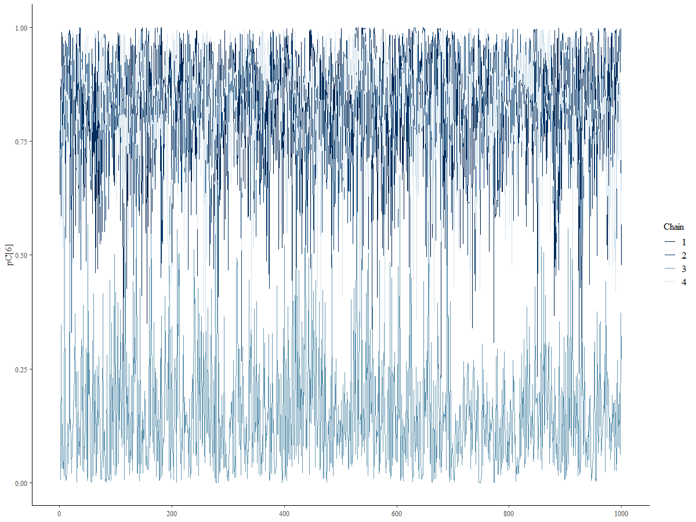

```{r klippy, echo=FALSE, include=TRUE}
klippy::klippy(position=c('top','right'),color='#33C1FF')
```


<style>
.list-group-item.active, .list-group-item.active:focus, .list-group-item.active:hover {
    z-index: 2;
    color: #fff;
    background-color: #33C1FF;
    border-color: #97CAEF;
}

</style>


```{r setup, include=FALSE}
knitr::opts_chunk$set(comment = "",fig.align='center',message = FALSE,warning = FALSE)
require(here)
require(ggplot2)
require(plot3D)
require(kableExtra)
require(knitr)
require(giski)
require(magick)
options(scipen=99)

```

`r paste('[Updated:',format(Sys.time(),'%a, %b %d, %Y - %H:%M:%S'),']')`

<font color="black">

# Acknowledgement

This tutorial is a product of a research project funded by Duolingo, Inc. through Competitive Research Grant Program to support topics of interest related to Duolingo's English Test's ongoing research agenda.

# Introduction

This tutorial provides a detailed introduction to an enhanced version of the model initially introduced by [Kasli et al. (2023)](https://doi.org/10.1111/jedm.12340). The original model assumed that the compromised status of items was known beforehand. It focused on estimating whether an examinee had item preknowledge, given a predefined vector indicating the compromise status of items using response time model. However, the study also revealed that when this vector was inaccurately specified, the model's ability to make accurate predictions declined significantly.

In the enhanced version presented here, the requirement for prior knowledge of item compromise status is removed. Instead, both examinee status and item compromise status are treated as unknown parameters to be estimated simultaneously. This upgraded model outputs two probabilities in a single analysis: the probability that an examinee has item preknowledge and the probability that an item is compromised.

# Model Description

The response time model incorporates additional parameters specific to response times while building on the notations introduced for response accuracy analysis. For the $j^{th}$ examinee
$\mathbf{RT}_j = (\mathrm{RT}_{j1}, \ldots, \mathrm{RT}_{jI})$ represents the vector of log-transformed response times for $I$ items, with realizations $\mathbf{rt}_j = (\mathrm{rt}_{j1}, \ldots, \mathrm{rt}_{jI})$. 

For the $i^{th}$ item, $\alpha_i \in \mathbb{R}^+$ and $\beta_i \in \mathbb{R}$ denote the time-discrimination and time-intensity parameters, respectively.

Two latent speed parameters are defined for each examinee: true latent speed ($\tau_{tj} \in \mathbb{R}$) used when responding to uncompromised items without prior knowledge, and cheating latent speed ($\tau_{cj} \in \mathbb{R}$) used when responding to compromised items with prior knowledge.

The log response time for the $j^{th}$ examinee on the $i^{th}$ item is modeled as:

$$
\mathrm{RT}_{ij} \sim f(\mathrm{rt}_{ij}; \tau_{tj}, \tau_{cj}, H_j, \alpha_i, \beta_i, C_i),$$

where, $f(.)$ is a normal density function and defined as:

$$
f(\mathrm{rt}_{ij}; \tau_{tj}, \tau_{cj}, H_j, \alpha_i, \beta_i, C_i) = \frac{1}{\sigma_i \sqrt{2\pi}} \exp\left(-\frac{1}{2} \left( \frac{\mathrm{rt}_{ij} - \mu_{ij}}{\sigma_i} \right)^2 \right)
$$

The mean $\mu_{ij}$ and standard deviation $\sigma_{i}$ are given by:

$$
\mu_{ij} = 
\begin{cases} 
\beta_i - \tau_{cj}, & \text{if } H_j = 1 \text{ and } C_i = 1, \\ 
\beta_i - \tau_{tj}, & \text{otherwise}.
\end{cases}
$$
$$
\sigma_i = \frac{1}{\alpha_i}
.$$

This model reflects that an examinee with prior knowledge (i.e., $H_j=1$ and $C_i=1$) uses the cheating latent speed, $\tau_{cj}$. In all other cases, the true latent speed, $\tau_{tj}$, is used.

During the model fitting process, the density, $f(\mathrm{rt}_{ij}; \tau_{tj}, \tau_{cj}, H_j, \alpha_i, \beta_i, C_i)$, is marginalized over the discrete parameters $H_j$ and $C_i$ as follows:

$$
f(\mathrm{rt}_{ij}; \tau_{tj}, \tau_{cj}, \alpha_i, \beta_i) = \sum_{H_j, C_i} f(\mathrm{rt}_{ij}; \tau_{tj}, \tau_{cj}, \alpha_i, \beta_i, H_j, C_i) \cdot P(H_j) \cdot P(C_i)
$$
To ensure model identification, the model constrained the mean of the true latent speed,$\tau_{tj}$, to be zero for scale identification.

The joint distribution of the true and cheating latent speed parameters is assumed to follow a multivariate normal distribution:

$$
\begin{pmatrix} 
\tau_{tj} \\ 
\tau_{cj}
\end{pmatrix}
\sim \mathcal{N}(\boldsymbol{\mu}_\tau, \Sigma_\tau),
$$

where,

$$
\Sigma_\tau = 
\begin{pmatrix} 
\sigma_{\tau_t}^2 & \rho_{\tau_t, \tau_c} \sigma_{\tau_t} \sigma_{\tau_c} \\ 
\rho_{\tau_t, \tau_c} \sigma_{\tau_t} \sigma_{\tau_c} & \sigma_{\tau_c}^2 
\end{pmatrix}.
$$
The priors for the mean, standard deviations, and correlation are specified as:

$$
\mu_{\tau_t} = 0, \quad \mu_{\tau_c} \sim \mathcal{N}(0, 2)
$$

$$
\sigma_{\tau_t}, \sigma_{\tau_c} \sim \text{Exponential}(1), \quad \rho_{\tau_t, \tau_c} \sim \text{LKJ}(1)
$$
Item parameters are similarly modeled as:

$$
\begin{pmatrix} 
\ln(\alpha_i) \\ 
\beta_i 
\end{pmatrix}
\sim \mathcal{N}(\boldsymbol{\mu}_I, \Sigma_I),
$$

where,

$$
\Sigma_I = 
\begin{pmatrix} 
\sigma_{\ln(\alpha)}^2 & \rho_{\ln(\alpha), \beta} \sigma_{\ln(\alpha)} \sigma_{\beta} \\ 
\rho_{\ln(\alpha), \beta} \sigma_{\ln(\alpha)} \sigma_{\beta} & \sigma_{\beta}^2 
\end{pmatrix}.
$$
The priors for the item parameters are specified as:

$$
\mu_{\ln(\alpha)} \sim \mathcal{N}(0, 0.5), \quad \mu_{\beta} \sim \mathcal{N}(4, 1), \quad \sigma_{\ln(\alpha)}, \sigma_\beta \sim \text{Exponential}(1), \quad \rho_{\ln(\alpha), \beta} \sim \text{LKJ}(1)
$$
The prior for the probabilities of $P(H_j = 1)$ and $P(C_i = 1)$ are specified as:

$$
P(H_j = 1) \sim \text{Beta}(1, 1)
$$

$$
P(C_i = 1) \sim \text{Beta}(1, 1)
$$

# Stan Model Syntax

The data block defines the structure and input data required for the model. It assumes that the data is provided in a long format, which is particularly advantageous for handling missing responses in sparse datasets. In this format, the data has at least a column for subject IDs (e.g., examinee identifiers), a column for item IDs, and another column for observed response times (or the logarithm of observed response times)

```{r, eval=FALSE,echo=TRUE}
data{
  int <lower=1> J;                       // number of examinees          
  int <lower=1> I;                       // number of items
  int <lower=1> n_obs;                   // number of observations (I xJ - missing responses)
  int <lower=1> p_loc[n_obs];            // person indicator   
  int <lower=1> i_loc[n_obs];            // item indicator
  real Y[n_obs];                         // vector of log of responses
}
```

The parameters and transformed parameters block specifies all the parameters required by the model. 

```{r, eval=FALSE,echo=TRUE}
parameters {
  real mu_beta;                 // mean for time intensity parameters
  real<lower=0> sigma_beta;     // sd for time intensity parameters
  
  real mu_alpha;                // mean for log of time discrimination parameters
  real<lower=0> sigma_alpha;    // sd for time discrimination parameters
  
  real<lower=0> sigma_taut;     // sd for tau_t
  real<lower=0> sigma_tauc;     // sd for tau_c
  
  corr_matrix[2] omega_P;       // 2 x 2 correlation matrix for person parameters
  corr_matrix[2] omega_I;       // 2 x 2 correlation matrix for item parameters
  
  vector<lower=0,upper=1>[J] pC; // vector of length J for the probability of item compromise status
  
  vector<lower=0,upper=1>[I] pH; // vector of length I for the probability of examinee item peknowledge 
  
  ordered[2] person[I];           // an array with length I for person specific latent parameters
  // Each array has two elements
  // first element is tau_t
  // second element is tau_c
  // ordered vector assures that tau_c > tau_t for every person
  // to make sure chains are exploring the same mode and 
  // multiple chains do not go east and west leading multi-modal posteriors
 
  
  vector[2] item[J];           // an array with length J for item specific parameters
  // each array has two elements
  // first element is alpha
  // second element is beta
}
}
```


```{r, eval=FALSE,echo=TRUE}
transformed parameters{
  
  vector[2] mu_P;                        // vector for mean vector of person parameters 
  vector[2] mu_I;                        // vector for mean vector of item parameters
  
  vector[2] scale_P;                     // vector of standard deviations for person parameters
  vector[2] scale_I;                     // vector of standard deviations for item parameters
  
  cov_matrix[2] Sigma_P;                 // covariance matrix for person parameters
  cov_matrix[2] Sigma_I;                 // covariance matrix for item parameters
  
  mu_P[1] = 0;
  mu_P[2] = mu_tauc;
  
  scale_P[1] = sigma_taut;               
  scale_P[2] = sigma_tauc;
  
  Sigma_P = quad_form_diag(omega_P, scale_P); 
  
  mu_I[1] = mu_alpha;
  mu_I[2] = mu_beta;
  
  scale_I[1] = sigma_alpha;               
  scale_I[2] = sigma_beta;
  
  Sigma_I = quad_form_diag(omega_I, scale_I); 
}
```

In the **parameters block**, I use `ordered[2] person[I]` to define the array for person-specific parameters instead of a simple `vector[2] person[I]`. The ordered type in Stan ensures that the elements of the vector are ordered, with the first element being smaller than the second. Specifically, in this case, it enforces that $\tau_c > \tau_t$ for every individual. 
This constraint has a crucial role in resolving potential issues with the posterior distributions. Without this enforced order, the model was prone to multi-modal posterior distributions. This problem arose because different Markov Chain Monte Carlo (MCMC) chains would explore inconsistent parameter directions. Some chains might converge on one mode, while others diverged to an alternative mode in the opposite direction, leading to incoherent results and difficulties in interpretation. Below provides an example of this issue without enforcing this order.




Finally, we specify the prior distributions and model in the **model block**. 

```{r, eval=FALSE,echo=TRUE}

model{
  
 
  sigma_taut  ~ exponential(1);
  sigma_tauc  ~ exponential(1);
  sigma_beta  ~ exponential(1);
  sigma_alpha ~ exponential(1);
  
  mu_beta      ~ normal(4,1);
  mu_alpha     ~ lognormal(0,0.5);
  
  pC ~ beta(1,1);
  pH ~ beta(1,1);
  
  omega_P   ~ lkj_corr(1);
  omega_I   ~ lkj_corr(1);
  
  person  ~ multi_normal(mu_P,Sigma_P);
  
  item    ~ multi_normal(mu_I,Sigma_I);
  
  
  for (i in 1:I) {
    for(j in 1:J) {
      
      // item[j,1] represents log of parameter alpha of the jth item
          // that's why we use exp(item[j,1]) below 
      
      // item[j,2] represents parameter beta of the jth item
      
      //person[i,1] represents parameter tau_t of the ith person
      //person[i,2] represents parameter tau_c of the ith person
      
      
      real p_t = item[j,2]-person[i,1];   //expected response time for non-cheating response, beta_i - tau_t_j
      real p_c = item[j,2]-person[i,2];  //expected response time for cheating response, beta_i - tau_t_c
      
      // log of probability densities for each combination of two discrete parameters
      // (C,T) = {(0,0),(0,1),(1,0),(1,1)}
      
      real lprt1 = log1m(pC[j]) + log1m(pH[i]) + normal_lpdf(RT[i,j] | p_t, 1/exp(item[j,1]));  // T = 0, C=0
      real lprt2 = log1m(pC[j]) + log(pH[i])   + normal_lpdf(RT[i,j] | p_t, 1/exp(item[j,1]));  // T = 1, C=0
      real lprt3 = log(pC[j])   + log1m(pH[i]) + normal_lpdf(RT[i,j] | p_t, 1/exp(item[j,1]));  // T = 0, C=1
      real lprt4 = log(pC[j])   + log(pH[i])   + normal_lpdf(RT[i,j] | p_c, 1/exp(item[j,1]));  // T = 1, C=1 
      
      target += log_sum_exp([lprt1, lprt2, lprt3, lprt4]);
      
    }
  }
  
}
```

The whole Stan syntax for the model can be saved as a stan file ([Download the Stan model syntax](https://github.com/czopluoglu/website/blob/master/docs/posts/dglnrt2/dglnrt.stan)).


</font>

